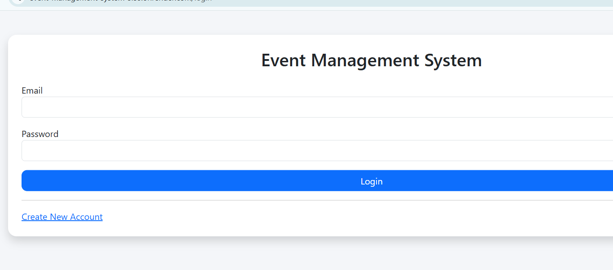
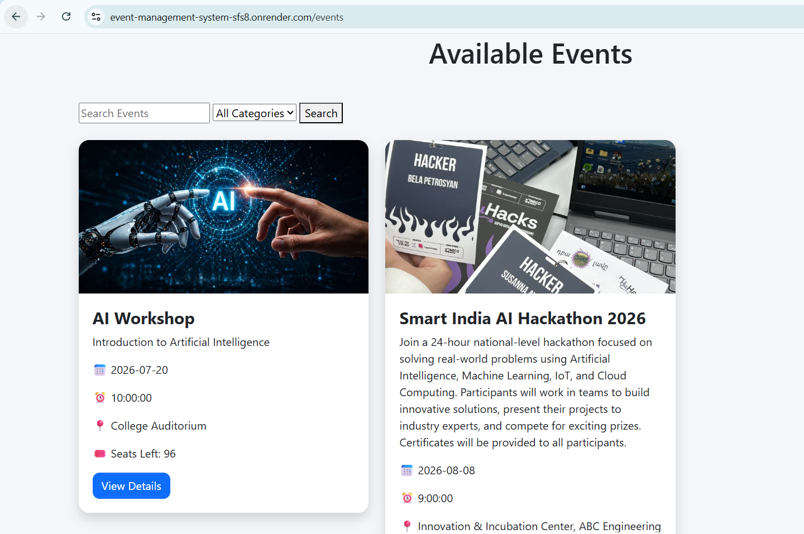
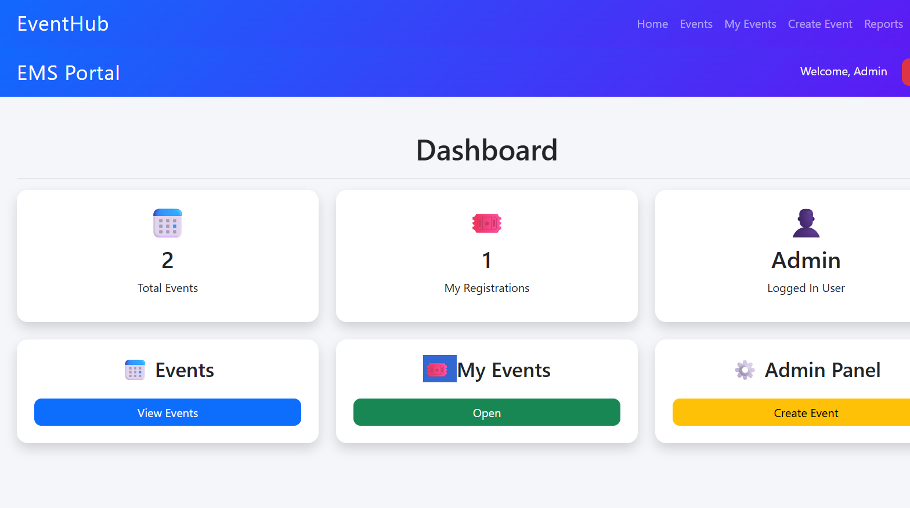

#  Event Management System

A full-stack Event Management System built using Flask and MySQL that allows users to browse, register for events, and submit feedback, while administrators can manage events, registrations, and reports through a dedicated dashboard.

##  Live Demo

**Live Website:** https://event-management-system-sfs8.onrender.com

##  Features

###  User
- User registration and login
- Browse available events
- Search and filter events
- Register for events
- View registered events
- Submit feedback

###  Admin
- Secure admin login
- Add, edit, and delete events
- Upload event images
- View registrations
- Generate reports
- Manage user feedback

##  Technologies Used

### Backend
- Python
- Flask
- Flask-Login
- Flask-WTF

### Database
- MySQL
- Railway Cloud MySQL

### Frontend
- HTML
- CSS
- Jinja2 Templates

### Deployment
- Render
- GitHub

##  Project Structure

```
Event-Management-System
│
├── Backend
│   ├── app.py
│   ├── db_config.py
│   ├── requirements.txt
│   ├── Procfile
│   ├── runtime.txt
│   ├── templates/
│   └── static/
│
└── Database
```

##  Installation

Clone the repository:

```bash
git clone https://github.com/sahana-cs-tech/Event-Management-System.git
```

Go to the project:

```bash
cd Event-Management-System/Backend
```

Install dependencies:

```bash
pip install -r requirements.txt
```

Run the application:

```bash
python app.py
```

##  Screenshots

### Home Page


### Login



### Events



### Admin Dashboard



##  Future Improvements

- Email notifications
- Online payment integration
- QR Code based event entry
- Certificate generation
- Event analytics dashboard

##  Developer

**Sahana C S**

GitHub:
https://github.com/sahana-cs-tech

---

⭐ If you found this project useful, consider giving it a star.
